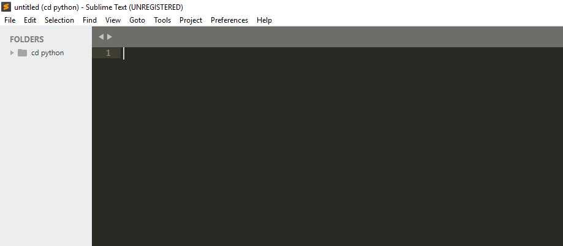
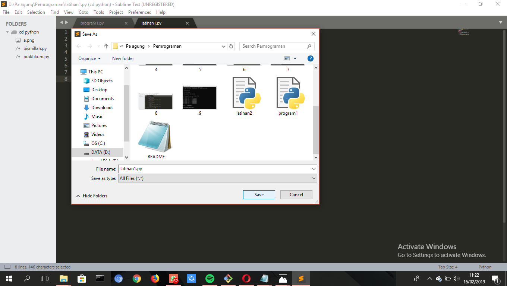
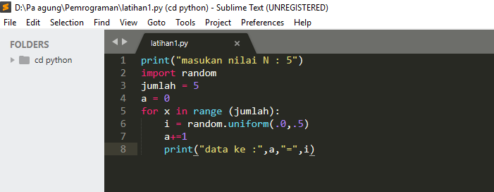
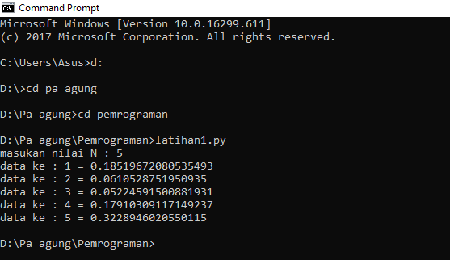
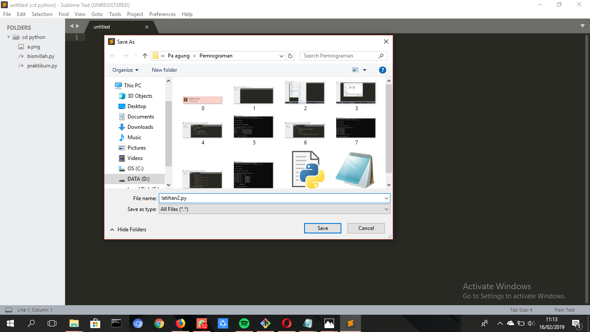
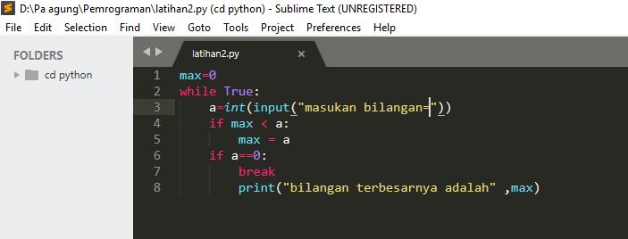
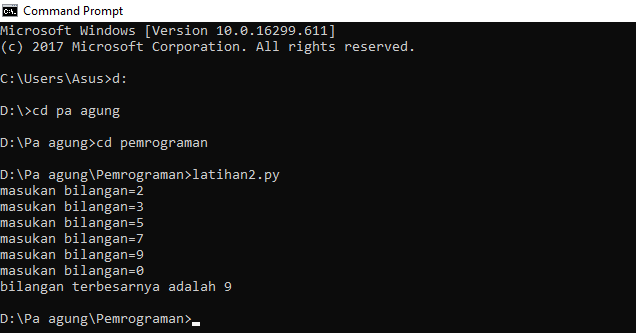
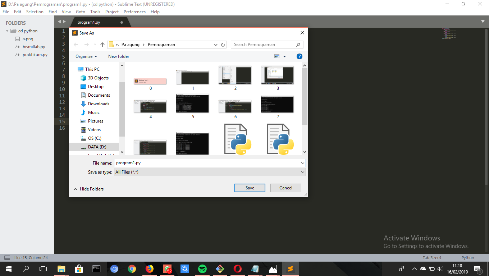
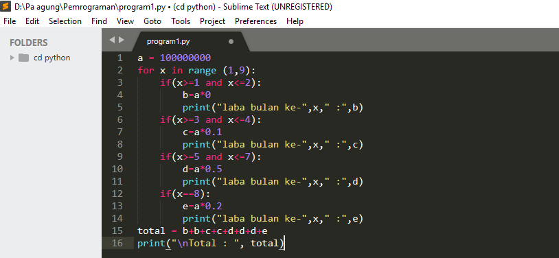
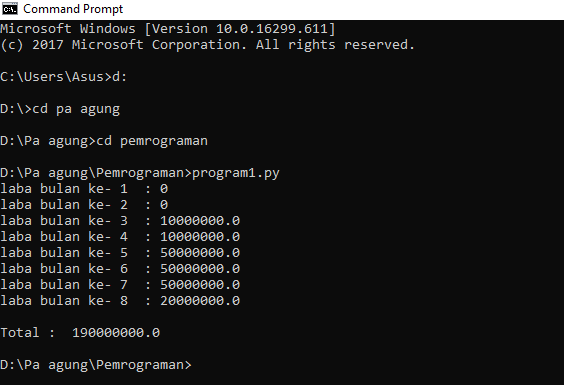

## PRAKTIKUM 3 ##
Dibawah ini pembuatan program latihan1.py,latihan2.py, dan program1.py.

## PEMBUATAN PROGRAM Latihan1.py  ## 
Buka aplikasi sublime,karena disini saya akan membuat program dengan menggunakan applikasi sublime.

## PERTAMA ##
Jika sudah, save dengan (ctrl+s) beri nama dengan akhiran ".py" (sebuah program python) lalu save. Seperti dibawah ini :

## KEDUA ##
Ketik seperti dibawah ini, dan perhatikan setiap penempatan titik dan koma pada sebuah program yang dijalankan.

## Penjelasan : ##
Print	: Untuk menampilkan suatu objek ke perangkat output.

Import 	: Fungsi lanjut yang dipanggil dari

Random	: Untuk menentukan suatu pilihan.

Range	: Sebuah fungsi yang menghasilkan list. Dimana fungsi ini membuat list baru dengan rentang nilai tertentu.

Uniform	: Untuk menampilkan bilangan random dengan batas awal "x"  dan batas akhir "y".

## KETIGA ##
Jika cara kedua sudah dijalankan, jangan lupa save (ctrl+s) dan jalankan program menggunakan "cmd/command prompt". Maka akan tampil eksekusi seperti dibawah ini :

## PEMBUATAN PROGRAM Latihan2.py ##
Buka aplikasi sublime,karena disini saya akan membuat program dengan menggunakan applikasi sublime.

## PERTAMA ##
Jika sudah, save dengan (ctrl+s) beri nama dengan akhiran ".py" (sebuah program python) lalu save. Seperti dibawah ini :

## KEDUA ##
Ketik seperti dibawah ini, dan perhatikan setiap penempatan titik dan koma pada sebuah program yang dijalankan.

## Penjelasan : ##
Menggunakan "max=0" dan type datanya itu "while True" karena jika suatu kodingan menggunakan while, kodingan itu tidak akan berhenti tanpa menginput bilangan "0". Maka jika kita menginput bilangan "0" , maka eksekusi selesai.
Max	: Untuk mencari nilai tertinggi, fungsi ini dapat diberikan pada parameter berupa angka.

While	: Untuk perulangan yang memiliki syarat dan tidak tentu berapa banyak perulangannya.

Int	: Berfungsi mengkonversi bilangan maupun string angka menjadi bilangan bulat (integer).

If	: Bila suatu kondisi tertentu tercapai maka apa yang harus dilakukan. Dengan fungsi ini kita bisa menjalankan suatu perintah dalam kondisi tertentu. 

Input	: Masukan yang kita berikan ke program.

Break	: Fungsi yang menghentikan operasi dibawahnya jika suatu kondisi yang ditentukan telah tercapai.

Print	: Berfungsi untuk menampilkan objek ke perangkat output.

## KETIGA ##
Jika cara kedua sudah dijalankan, jangan lupa save (ctrl+s) dan jalankan program menggunakan "cmd/command prompt". Maka akan tampil eksekusi seperti dibawah ini :

## PEMBUATAN PROGRAM Program1.py ##
Buka aplikasi sublime,karena disini saya akan membuat program dengan menggunakan applikasi sublime.

## PERTAMA ##
Jika sudah, save dengan (ctrl+s) beri nama dengan akhiran ".py" (sebuah program python) lalu save. Seperti dibawah ini :

## KEDUA ##
Ketik seperti dibawah ini, dan perhatikan setiap penempatan titik dan koma pada sebuah program yang dijalankan.

## Penjelasan : ##
Print
		: Berfungsi untuk menampilkan objek ke perangkat output.
If		: Bila suatu kondisi tertentu tercapai maka apa yang harus dilakukan. Dengan fungsi ini kita bisa menjalankan suatu perintah dalam kondisi tertentu. 

For		: Perulangan yang terhitung.

Range		: Mengembalikan deret integer berurut pada range yang ditentukan dari start sampai stop.

\nTotal		: Membuat garis baru, dan menampilkan total hasil dari apa yang kita inginkan.

## KETIGA ##
Jika cara kedua sudah dijalankan, jangan lupa save (ctrl+s) dan jalankan program menggunakan "cmd/command prompt". Maka akan tampil eksekusi seperti dibawah ini :

Demikian yang hanya bisa saya sampaikan. Bila ada kekurangan saya mohon maaf. Sekian dan Terima kasih. "Shella Ayu Lestari TI.18.A1".
